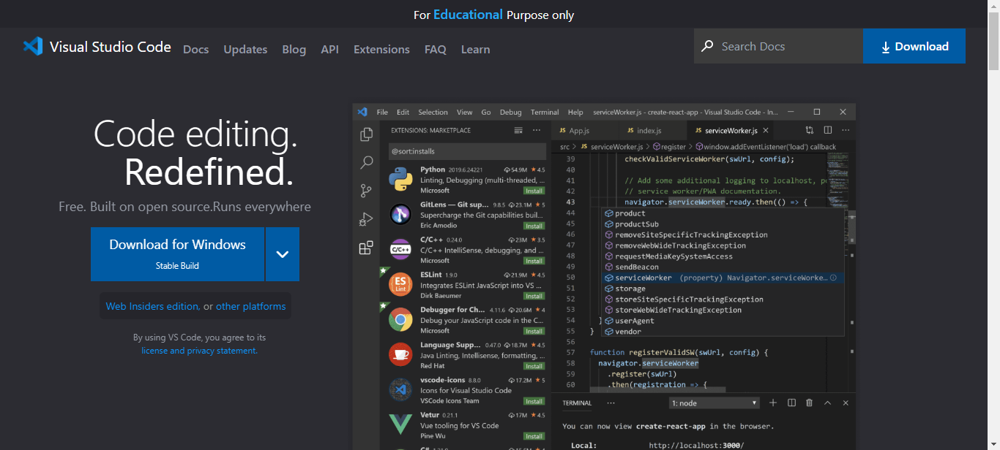

---

## Visual Studio Code Page Clone

Learning from this project :

- Learn about **Tailwind css** 

- Learn About how to use **tailwind css classes**

- got some idea on **tailwind css**

---
## Output -

